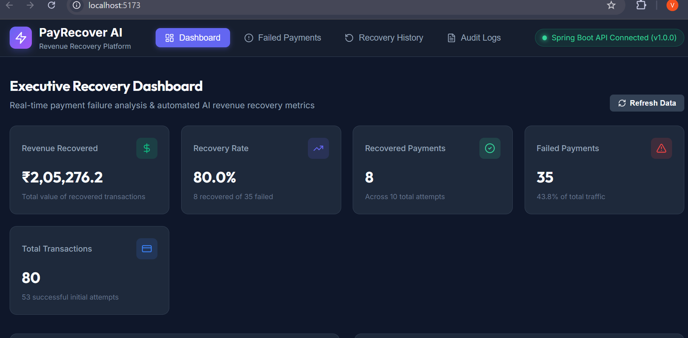
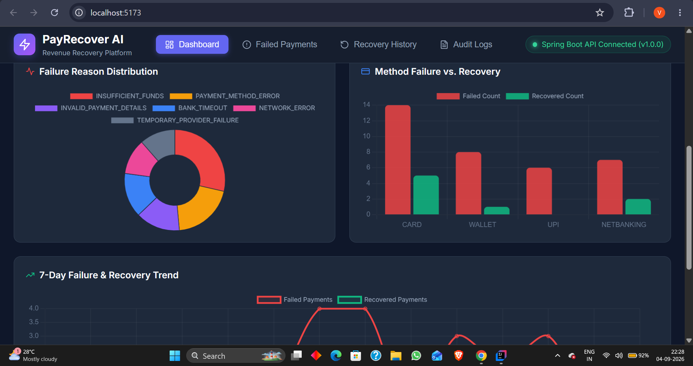
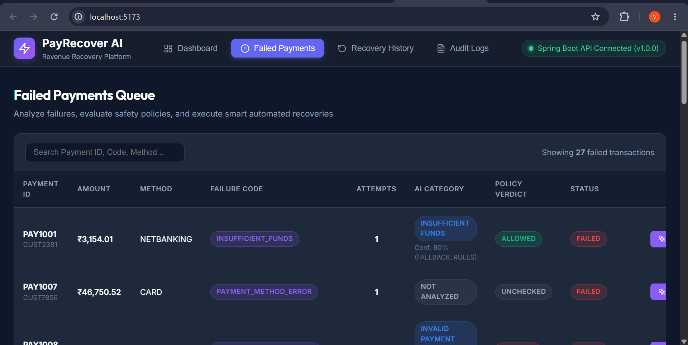

# 💳 PayRecover AI

### AI-Powered Failed Payment Recovery & Decision System

> **Don't just detect payment failures — understand them, decide safely, and recover the revenue.**

PayRecover AI transforms a failed payment into an **explainable recovery decision** using AI diagnosis, deterministic safety policies, and a controlled recovery simulator.

---
## 🖥️ Dashboard UI


The merchant dashboard provides a simple view of payment and recovery performance.






## 💳 Failed Payments




---

## ⚡ At a Glance

| 🚀                     |                                                          |
| ---------------------- | -------------------------------------------------------- |
| **AI Diagnosis**       | Identifies the probable reason behind payment failure    |
| **Smart Recovery**     | Recommends the most suitable recovery action             |
| **Policy Guardrails**  | Prevents unsafe or excessive retries                     |
| **Recovery Simulator** | Simulates financial recovery without real transactions   |
| **Full Traceability**  | Every decision is recorded in audit logs                 |
| **Merchant Dashboard** | Real-time visibility into failures and recovered revenue |

---

## 🎯 The Problem

Failed payments directly translate into **lost revenue**.

Traditional systems often stop at:

```text
Payment Failed ❌
```

PayRecover AI goes further:

```text
Payment Failed
      ↓
Why did it fail?
      ↓
What should we do?
      ↓
Is that action safe?
      ↓
Can we recover the payment?
      ↓
How much revenue was recovered?
```

---

## 🧠 How PayRecover AI Works

```text
┌──────────────────┐
│  Failed Payment  │
└────────┬─────────┘
         ↓
┌──────────────────┐
│   AI Diagnosis   │
│  Failure Reason  │
└────────┬─────────┘
         ↓
┌──────────────────┐
│ Recovery Action  │
│   Recommendation │
└────────┬─────────┘
         ↓
┌──────────────────┐
│  Policy Engine   │
│ Safety Checks    │
└────────┬─────────┘
         ↓
   ┌─────┼─────┐
   ↓     ↓     ↓
 ALLOWED BLOCKED ESCALATED
   ↓
┌──────────────────┐
│ Recovery Simulator│
└────────┬─────────┘
         ↓
 RECOVERED / FAILED
         ↓
┌──────────────────┐
│ Audit + Dashboard│
└──────────────────┘
```

### 🔐 Core Principle

> **AI recommends → Rules decide → Simulator executes → Audit records**

This prevents an AI model from directly controlling financial actions.

---

## 🤖 AI + Safety

PayRecover AI uses an LLM for **failure diagnosis and recovery recommendations**.

If the LLM is unavailable, the system automatically falls back to **deterministic rules**.

### Example

```text
Failure Code
INSUFFICIENT_FUNDS

        ↓

AI Diagnosis
Insufficient Funds

        ↓

Recommendation
Try Another Payment Method

        ↓

Confidence
80%
```

---

## 🛡️ Deterministic Policy Engine

Before any retry is simulated, the recommendation passes through safety checks.

| Policy Check         | Purpose                          |
| -------------------- | -------------------------------- |
| Category Eligibility | Prevent invalid recovery actions |
| Attempt Limit        | Prevent excessive retries        |
| High-Value Guardrail | Protect large transactions       |
| AI Confidence        | Require sufficient confidence    |

### Policy Outcomes

```text
🟢 ALLOWED      → Recovery can execute
🔴 BLOCKED      → Recovery is stopped
🟡 ESCALATED    → Manual intervention required
```

---

## 💰 Recovery Simulation

No real money is moved.

The system safely simulates the financial execution:

```text
ALLOWED
   ↓
Simulated Retry
   ├── 85% → ✅ RECOVERED
   └── 15% → ❌ FAILED_AGAIN
```

A successful recovery updates the payment, recovered revenue, recovery history, audit log, and dashboard metrics.

---

## 📊 Verified Results

The system has been tested with real seeded payment scenarios.

| Metric                 |                   Verified Result |
| ---------------------- | --------------------------------: |
| 🟢 Successful Recovery |                     **₹7,530.17** |
| 💰 Revenue Recovered   |                   **₹205,276.20** |
| 📈 Recovery Rate       |                        **80.00%** |
| 🔄 Recovery Attempts   |                       **Tracked** |
| 🛡️ Policy Decisions   | **Allowed / Blocked / Escalated** |
| 📝 Audit Trail         |                **Fully Recorded** |

### Example Recovery

```text
PAY1075
        ↓
Temporary Provider Failure
        ↓
WAIT_AND_RETRY
        ↓
Policy: ALLOWED
        ↓
Attempt #2
        ↓
✅ RECOVERED
        ↓
₹7,530.17 Revenue Recovered
```

---

## 🖥️ Dashboard

The merchant dashboard provides a simple view of:

* Total payments
* Successful & failed payments
* Recovery attempts
* Recovered payments
* Revenue recovered
* Recovery rate
* Failed payment analysis
* Policy decisions
* Recovery history
* Audit logs

> **One dashboard. Complete recovery visibility.**

---

## 🏗️ Technology Stack

**Backend**

`Java 17` · `Spring Boot` · `Spring Data JPA` · `Hibernate` · `Maven`

**Database**

`MySQL`

**AI**

`Groq LLM` · `Rule-Based Fallback`

**Frontend**

`React` · `Vite` · `JavaScript` · `Chart.js`

---

## 🔌 REST API

```text
/api/payments
/api/payments/failed
/api/payments/{id}/analyze
/api/payments/{id}/policy
/api/payments/{id}/recover
/api/payments/{id}/recovery-history
/api/recoveries
/api/audit-logs/{id}
/api/dashboard/summary
```

---

## 🚀 Run Locally

### Backend

```bash
mvn spring-boot:run
```

Runs on:

```text
http://localhost:8080
```

### Frontend

```bash
npm install
npm run dev
```

Configure your Groq API key as an environment variable:

```text
GROQ_API_KEY=your_api_key
```

> Never commit API keys or secrets to GitHub.

---

## 🔮 Future Scope

* Real payment gateway integration
* Predictive recovery probability
* Merchant-specific recovery policies
* Automated retry scheduling
* Advanced fraud/risk intelligence
* Production monitoring and observability

---

## 🏆 Why PayRecover AI?

Most payment systems answer:

> **"Why did the payment fail?"**

PayRecover AI answers:

> **"Why did it fail, what should we do, is it safe, and how much can we recover?"**

### **AI + Safety + Recovery + Explainability**

**That's PayRecover AI.**
